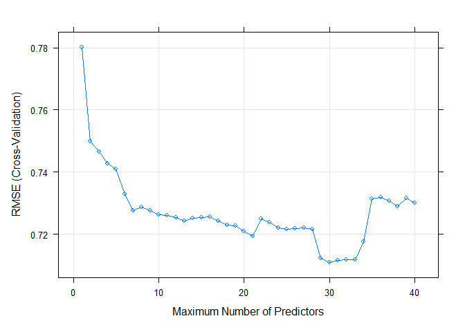

Training Linear Regression Models Using `caret`
================
John Williams
12/20/2021

-   [Resources](#resources)
    -   [Packages](#packages)
    -   [Reproducibility](#reproducibility)
    -   [Helper Functions](#helper-functions)
    -   [Data](#data)
-   [Preliminary Steps](#preliminary-steps)
    -   [Checking for Problems with the
        Predictors](#checking-for-problems-with-the-predictors)
    -   [Partitioning the Data](#partitioning-the-data)
    -   [Resampling](#resampling)
    -   [Comparing Models](#comparing-models)
-   [Model Training](#model-training)
    -   [First-Order Multiple Linear
        Regression](#first-order-multiple-linear-regression)
    -   [Second-Order Multiple Linear
        Regression](#second-order-multiple-linear-regression)
    -   [Second-Order Multiple Linear Regression with
        Interaction](#second-order-multiple-linear-regression-with-interaction)
-   [Model Shrinkage](#model-shrinkage)
    -   [Backward Elimination](#backward-elimination)
    -   [Forward Selection](#forward-selection)
    -   [Lasso Regression](#lasso-regression)
-   [Model Selection](#model-selection)
-   [Citations](#citations)

In this vignette, we explore the process for creating predictive linear
regression models. Our goal is to predict wine quality using one of
these models.

To streamline our work, we use the `caret` package in R to train our
models. `caret` provides tools for:

-   partitioning data
-   pre-processing data
-   selecting training methods
-   model tuning using resampling
-   estimating variable importance

Most importantly, `caret` provides a uniform interface for model
training and prediction. We can chose from over 230 different modeling
functions in R without needing to learn the unique syntax for each one.
To learn more about `caret`, click
[here](https://topepo.github.io/caret/index.html).

## Resources

### Packages

We use the following R packages in this vignette:

-   `tidyverse` - Set of packages that work in harmony as they share
    common data representations and API design.
-   `corrplot` - Provides a visual exploratory tool on correlation
    matrix that supports automatic variable reordering to help detect
    hidden patterns among variables.
-   `caret` - Various functions for training and plotting classification
    and regression models.
-   `leaps` - Provides an efficient function for subset selection in
    linear regression, including exhaustive search.
-   `pls` - Implements Principal Component Regression (PCR) and Partial
    Least Squares Regression (PLSR)
-   `elasticnet` - Provides functions for fitting penalized regression
    models

### Reproducibility

For reproducibility…

``` r
set.seed(2021)
seeds <- vector(mode = "list", length = 100)
for(i in 1:100) seeds[[i]] <- sample.int(1000, 100)
```

### Helper Functions

These helper functions are used within this vignette. They are not
generic; they are specific for models trained in this vignette.

-   `predictorNames` - Returns a character vector of the names of
    predictors used within a specific backward or forward elimination
    model.
-   `createFormula` - Given a vector of predictor names, returns a
    formula that can be used within the function `lm`.

``` r
# Function that returns a character vector of the names of predictors used
# within a specific backward or forward elimination model. This function is not
# generic; it is specific for models trained in this vignette.
predictorNames <- function(fit, nvmax){
  fit.summary <- summary(fit)
  vec <- fit.summary$which[nvmax, ]
  df <- t(as.data.frame(vec))
  fit.nvmax <- df[ , names(vec)[vec]]
  names <- names(fit.nvmax)[-1]
  names.corrected <- str_replace_all(names, "typewhite", "type")
  return(names.corrected)
}

# Given a vector of predictor names, this function returns a formula that can be
# used within the function `lm`. This function is not generic; it is specific
# for models trained in this vignette.
createFormula <- function(charVec){
  formula <- as.formula(paste0("quality ~ ", paste(charVec, collapse = " + ")))
  return(formula)
}
```

### Data

To train our models, we use the [Wine Quality Data
Set](https://archive.ics.uci.edu/ml/datasets/wine+quality) from the UC
Irvine Machine Learning Repository. It includes two datasets which are
related to red and white variants of the Portuguese “Vinho Verde” wine.
Both datasets include intrinsic physical and chemical characteristics of
the wine. They do not include identifiable features such as grape type,
wine brand, and wine selling price. For simplicity, we merge the two
datasets, creating a categorical variable for wine type:

``` r
red <- read.csv2("data/winequality-red.csv") %>%
       mutate_if(is.character, as.numeric) %>%  # Convert all character
                                                # variables to numeric
       mutate(type = "red")

white <- read.csv2("data/winequality-white.csv") %>%
         mutate_if(is.character, as.numeric) %>%
         mutate(type = "white")

wine <- bind_rows(red, white) %>%
        mutate(type = as.factor(type)) %>%
        rename(free.SO2 = free.sulfur.dioxide,
               total.SO2 = total.sulfur.dioxide)
```

Now that we have our wine quality data in a tidy format, let’s take a
closer look at the variables. There are 13 wine attributes presented in
the dataset `wine`:

-   `fixed.acidity`
-   `volatile.acidity`
-   `citric.acid`
-   `residual.sugar`
-   `chlorides`
-   `free.SO2`
-   `total.SO2`
-   `density`
-   `pH`
-   `sulphates`
-   `alcohol`
-   `type`
-   `quality`

The first 11 are numeric variables. The twelfth, `type`, is a factor,
either “red” or “white” wine. The last attribute, `quality`, is the
response; it is based on sensory data and scored from 0 to 10.

## Preliminary Steps

### Checking for Problems with the Predictors

Before we begin the process of developing a regression model to predict
wine quality, we should determine if there are any problems with our
predictor variables. Should the effect of measurement errors be
considered in the model? Do the predictor variables need scaling? Are
some predictors linear combinations of other predictors?

For the first question, we will ignore possible errors in measurement as
we do not have information on how the physical and chemical
characteristics of wines were obtained. For scaling, the `caret` package
will conveniently convert all the predictors to standard units (mean 0
and variance 1). So we just need to focus on the last question: is there
colinearity among predictors.

Colinearity occurs when two or more predictor variables are highly
correlated. If our predictors are not independent of each other, we
could face problems when we fit a model and interpret the results. Using
the `corrplot` package, we can view the correlation among predictors as
a graph:

``` r
# Compute correlation matrix
corMatrix <- round(cor(wine[ , 1:11]), 2)

# Display correlation matrix as a graph
corrplot::corrplot(corMatrix,
                   method = "color",  # Visualization method
                   diag = FALSE,      # Do not include the diagonal
                   type = "upper",    # Only display upper triangular matrix
                   order = "hclust",  # Display variables in hierarchical
                                      # clustering order
                   tl.col = "black",  # Set color of text for row/column labels
                   tl.srt = 45,       # Rotate column names by 45 degrees
                   addCoef.col = "black",  # Add the correlation coefficients
                   title = "Correlation of Predictors",
                   mar = c(0,0,1,0))  # Set graph margins
```

<!-- -->

`alcohol` and `density` have a pairwise correlation of -0.69;
`free.sulfur.dioxide` and `total.sulfur.dioxide` have a pairwise
correlation of 0.72. It’s possible that these predictors are not
independent within pairs. We should be mindful of this as we begin to
train models.

### Partitioning the Data

Creating a training set and test set is an important first step in
building a regression model. As the names imply, the training set is
used to fit (or train) our models; the test set is used to see how well
the final model performs on “new” data. The `caret` package provides a
useful function, `createDataPartition`, to partition data into two
independent sets that follow the same probability distributions. Here we
create a training set that is 70% of the original data (with the test
set having the remaining 30%):

``` r
# Create data partition index
trainIndex <- createDataPartition(wine$quality,
                times = 1,     # The number of partitions to create
                p = 0.70,      # The percentage of data that goes to training
                list = FALSE)  # Results should be in a matrix, not list

# Create training set
wineTrain <- wine[ trainIndex, ]

# Create test set
wineTest  <- wine[-trainIndex, ]
```

### Resampling

We use the generic `train` function in the `caret` package to fit our
linear regression models. This function can evaluate, using resampling,
the effect of model tuning parameters on performance. For our models, we
use 10-fold cross validation as the resampling method. We create a
global object `lmControl` that specifies the resampling method in the
appropriate syntax `train` needs:

``` r
# Set the resampling method for training all models
lmControl <- trainControl(method = "cv",  # Cross validation
                          number = 10,    # 10-Fold
                          seeds = seeds)  # For reproducibility
```

If we wish to change the resampling method used for training our models,
we can simply adjust this object.

For a review of cross validation, click [here]().

### Comparing Models

To compare the performance of one model to another, we will use two
metrics: RMSE and adjusted R-squared. Root Mean Square Error (RMSE) is
the standard deviation of the residuals (prediction errors). A model
with a lower RMSE generally implies a better fit. Adjusted R-squared
measures the proportion of variation in the response explained by the
linear regression model after adjusting for the number of predictors. A
model with a higher adjusted R-squared implies a better fit with
parsimony.

## Model Training

### First-Order Multiple Linear Regression

For our first prediction model, let’s fit a first-order multiple linear
regression with all predictors (without interactions or higher order
terms). This model is represented as

*Y* = *β*<sub>0</sub> + *β*<sub>1</sub>*X*<sub>1</sub> + *β*<sub>2</sub>*X*<sub>2</sub> + ... + *β*<sub>*n*</sub>*X*<sub>*n*</sub> + *ϵ*

where *Y* is the dependent variable (response), *X*<sub>*i*</sub> are
the independent variables (predictors), and *ϵ* is the random error
term.

``` r
set.seed(2021)  # For reproducibility

firstFit <- train(quality ~ ., 
                  data = wineTrain,
                  method = "lm",
                  preProcess = c("center", "scale"),
                  trControl = lmControl)

# Display summary of the fitted model
firstFit.summary <- summary(firstFit)
firstFit.summary
```

    ## 
    ## Call:
    ## lm(formula = .outcome ~ ., data = dat)
    ## 
    ## Residuals:
    ##     Min      1Q  Median      3Q     Max 
    ## -3.3689 -0.4685 -0.0455  0.4519  2.7414 
    ## 
    ## Coefficients:
    ##                  Estimate Std. Error t value Pr(>|t|)    
    ## (Intercept)       5.82106    0.01087 535.695  < 2e-16 ***
    ## fixed.acidity     0.11548    0.02382   4.847 1.30e-06 ***
    ## volatile.acidity -0.23340    0.01598 -14.607  < 2e-16 ***
    ## citric.acid      -0.01449    0.01382  -1.049    0.294    
    ## residual.sugar    0.29394    0.03377   8.704  < 2e-16 ***
    ## chlorides        -0.01394    0.01396  -0.999    0.318    
    ## free.SO2          0.11525    0.01641   7.025 2.46e-12 ***
    ## total.SO2        -0.11018    0.02206  -4.995 6.11e-07 ***
    ## density          -0.30871    0.05018  -6.152 8.29e-10 ***
    ## pH                0.08581    0.01747   4.911 9.40e-07 ***
    ## sulphates         0.10462    0.01341   7.802 7.53e-15 ***
    ## alcohol           0.26833    0.02507  10.702  < 2e-16 ***
    ## typewhite        -0.11881    0.02903  -4.093 4.34e-05 ***
    ## ---
    ## Signif. codes:  0 '***' 0.001 '**' 0.01 '*' 0.05 '.' 0.1 ' ' 1
    ## 
    ## Residual standard error: 0.7329 on 4536 degrees of freedom
    ## Multiple R-squared:  0.2995, Adjusted R-squared:  0.2977 
    ## F-statistic: 161.6 on 12 and 4536 DF,  p-value: < 2.2e-16

``` r
# Save results of fitted model in a named vector
firstFit.results <- c("RMSE" = firstFit.summary$sigma, 
                      "adjR^2" = firstFit.summary$adj.r.squared)
```

For model comparison later, we note that the RMSE for `firstFit` is
0.7328964 and its adjusted R-squared is 0.2976827.

Let’s examine the variable importance in the model `firstFit`. Variable
importance is the relative influence of each variable in the model; or,
in other words, how much the model “uses” each variable to make accurate
predictions. The more a model relies on a variable to make predictions,
the more important it is for the model. `caret` provides a useful
function, `varImp`, to calculate variable importance for models produced
by `train`.

``` r
# Calculate variable importance
varImp <- varImp(firstFit)

# Reformat output from varImp() so it can be used by ggplot()
importance <- as_tibble(varImp$importance, rownames = "variable") %>%
              arrange(desc(Overall))

# Output a graph of the variable importance
ggplot(importance,
         aes(x = reorder(variable, Overall), 
             y = Overall, fill = Overall)) +
         geom_col() +
         coord_flip() +
         theme(legend.position = "none") +
         labs(x = "Predictors",  
              y = "Importance %", 
              title = "Variable Importance",
              subtitle = "First-Order Multiple Linear Regression Model")
```

<!-- -->

We see `volatile.acidity` and `alcohol` contribute the most to
predicting wine quality; `chlorides` and `citric.acid` contribute the
least. `chlorides` is also the only variable that is not statistically
significant (at level *α* = 0.05) in this model.

### Second-Order Multiple Linear Regression

In this section, we introduce second-order terms as predictors to see if
we can create a better model. We do not yet consider interaction terms.
This model is represented as

*Y* = *β*<sub>0</sub> + *β*<sub>1</sub>*X*<sub>1</sub> + ... + *β*<sub>*n*</sub>*X*<sub>*n*</sub> + *β*<sub>*n* + 1</sub>*X*<sub>1</sub><sup>2</sup> + ... + *β*<sub>2*n*</sub>*X*<sub>*n*</sub><sup>2</sup> + *ϵ*

where *Y* is the dependent variable (response), *X*<sub>*i*</sub> are
the independent variables (predictors), and *ϵ* is the random error
term.

``` r
set.seed(2021)  # For reproducibility

secondFit <- train(quality ~ . + I(fixed.acidity^2) + I(volatile.acidity^2) +
                     I(citric.acid^2) + I(residual.sugar^2) + I(chlorides^2) +
                     I(free.SO2^2) + I(total.SO2^2) + I(density^2) + I(pH^2) +
                     I(sulphates^2) + I(alcohol^2),
                   data = wineTrain,
                   method = "lm",
                   preProcess = c("center", "scale"),
                   trControl = lmControl)

# Display summary of the fitted model
secondFit.summary <- summary(secondFit)
secondFit.summary
```

    ## 
    ## Call:
    ## lm(formula = .outcome ~ ., data = dat)
    ## 
    ## Residuals:
    ##     Min      1Q  Median      3Q     Max 
    ## -3.2681 -0.4777 -0.0343  0.4548  2.6099 
    ## 
    ## Coefficients:
    ##                           Estimate Std. Error t value Pr(>|t|)    
    ## (Intercept)               5.821060   0.010706 543.703  < 2e-16 ***
    ## fixed.acidity             0.088822   0.081016   1.096 0.272983    
    ## volatile.acidity         -0.321114   0.043433  -7.393 1.70e-13 ***
    ## citric.acid               0.037360   0.038213   0.978 0.328288    
    ## residual.sugar            0.502196   0.059099   8.497  < 2e-16 ***
    ## chlorides                 0.021190   0.029669   0.714 0.475139    
    ## free.SO2                  0.382290   0.041552   9.200  < 2e-16 ***
    ## total.SO2                -0.141788   0.061092  -2.321 0.020338 *  
    ## density                 -34.383066   6.271390  -5.483 4.42e-08 ***
    ## pH                        0.257616   0.301263   0.855 0.392530    
    ## sulphates                 0.190949   0.040657   4.697 2.72e-06 ***
    ## alcohol                  -0.541902   0.203024  -2.669 0.007631 ** 
    ## typewhite                -0.158996   0.032459  -4.898 1.00e-06 ***
    ## `I(fixed.acidity^2)`      0.047290   0.076284   0.620 0.535344    
    ## `I(volatile.acidity^2)`   0.087266   0.040253   2.168 0.030215 *  
    ## `I(citric.acid^2)`       -0.056140   0.034797  -1.613 0.106738    
    ## `I(residual.sugar^2)`    -0.256095   0.057009  -4.492 7.22e-06 ***
    ## `I(chlorides^2)`         -0.025745   0.026224  -0.982 0.326281    
    ## `I(free.SO2^2)`          -0.265678   0.035766  -7.428 1.31e-13 ***
    ## `I(total.SO2^2)`          0.003911   0.049481   0.079 0.937001    
    ## `I(density^2)`           34.031006   6.260483   5.436 5.74e-08 ***
    ## `I(pH^2)`                -0.162800   0.302893  -0.537 0.590960    
    ## `I(sulphates^2)`         -0.081509   0.040065  -2.034 0.041965 *  
    ## `I(alcohol^2)`            0.743427   0.203727   3.649 0.000266 ***
    ## ---
    ## Signif. codes:  0 '***' 0.001 '**' 0.01 '*' 0.05 '.' 0.1 ' ' 1
    ## 
    ## Residual standard error: 0.7221 on 4525 degrees of freedom
    ## Multiple R-squared:  0.3217, Adjusted R-squared:  0.3182 
    ## F-statistic: 93.29 on 23 and 4525 DF,  p-value: < 2.2e-16

``` r
# Save results of fitted model in a named vector
secondFit.results <- c("RMSE" = secondFit.summary$sigma, 
                       "adjR^2" = secondFit.summary$adj.r.squared)
```

We remember for model comparison later that the RMSE for `secondFit` is
0.7221019 and its adjusted R-squared is 0.3182187.

How does variable importance look for the `secondFit` model:

``` r
# Calculate variable importance
varImp <- varImp(secondFit)

# Reformat output from varImp() so it can be used by ggplot()
importance <- as_tibble(varImp$importance, rownames = "variable") %>%
              arrange(desc(Overall))

# Output a graph of the variable importance
ggplot(importance,
         aes(x = reorder(variable, Overall), 
             y = Overall, fill = Overall)) +
         geom_col() +
         coord_flip() +
         theme(legend.position = "none") +
         labs(x = "Predictors",  
              y = "Importance %", 
              title = "Variable Importance",
              subtitle = "Second-Order Multiple Linear Regression Model")
```

<!-- -->

Comparing the importance of variables in models `firstFit` and
`secondFit`, we find some similarities and some differences:

-   `volatile.acidity` remains relatively important in both models.
-   `chlorides` remains unimportant in both models, and its companion
    second-order term `chlorides^2` is also statistically insignificant
    in the `secondFit` model.
-   While the first-order predictor `alcohol` is very important in the
    `firstFit` model, it is negligibly important in the `secondFit`
    model.
-   In the `secondFit` model, `alcohol^2` is a more important predictor
    than its lower-order partner `alcohol`.

### Second-Order Multiple Linear Regression with Interaction

Now, we turn our attention to a second-order multiple linear regression
that includes all first-order pairs of interaction terms. If we only had
2 predictors, we could represent this model as

*Y* = *β*<sub>0</sub> + *β*<sub>1</sub>*X*<sub>1</sub> + *β*<sub>2</sub>*X*<sub>2</sub> + *β*<sub>3</sub>*X*<sub>1</sub>*X*<sub>2</sub> + *β*<sub>4</sub>*X*<sub>1</sub><sup>2</sup> + *β*<sub>5</sub>*X*<sub>2</sub><sup>2</sup> + *ϵ*

where *Y* is the dependent variable (response), *X*<sub>*i*</sub> are
the independent variables (predictors), and *ϵ* is the random error
term.

``` r
set.seed(2021)  # For reproducibility

polyFit <- train(quality ~ . * . + I(fixed.acidity^2) +I(volatile.acidity^2) +
                   I(citric.acid^2) + I(residual.sugar^2) + I(chlorides^2) +
                   I(free.SO2^2) + I(total.SO2^2) + I(density^2) + I(pH^2) +
                   I(sulphates^2) + I(alcohol^2),
                 data = wineTrain,
                 method = "lm",
                 preProcess = c("center", "scale"),
                 trControl = lmControl)

# Create summary of the fitted model
polyFit.summary <- summary(polyFit)

# Save results of fitted model in a named vector
polyFit.results <- c("RMSE" = polyFit.summary$sigma, 
                     "adjR^2" = polyFit.summary$adj.r.squared)
```

Since the model `polyFit` has 89 predictors, the model summary output
would be quite long and we chose not to print it here. We can summarize
the `polyFit` model by acknowledging its RMSE, 0.6968872, and its
adjusted R-squared, 0.3650009. We can also summarize the variable
importance for this model:

``` r
# Calculate variable importance
varImp <- varImp(polyFit)

# Reformat output from varImp() so it can be used by ggplot()
importance <- as_tibble(varImp$importance, rownames = "variable") %>%
              arrange(desc(Overall))

last <- length(predictors(polyFit))

# Output a graph of the variable importance (top 10 and bottom 10 only)
ggplot(importance[c(1:10, (last-9):last), ],
         aes(x = reorder(variable, Overall), 
             y = Overall, fill = Overall)) +
         geom_col() +
         coord_flip() +
         theme(legend.position = "none") +
         labs(x = "Predictors",  
              y = "Importance %", 
              title ="Variable Importance of `polyFit` Model",
              subtitle = "Top 10 and Bottom 10 Only")
```

<!-- -->

Comparing the RMSE and adjusted R-squared of the three models we’d
trained so far, we find the `polyFit` model, which includes interaction
and second-order terms, is likely a better predicting model than one
that excludes these terms.

## Model Shrinkage

The model `polyFit` has a large number of predictors, 89 in total, and
more than half are not statistically significant. Ideally, we want a
“good fitting” model that is not so complex. We prefer a parsimonious
model, one that predicts accurately with the fewest amount of predictors
possible. In other words, our goal is to shrink the number of predictors
and still have a model with a relatively low RMSE and high adjusted
R-squared. The `caret` package offers a wide-range of linear regression
methods to shrink our models. In this section, we will consider training
models using backward elimination, forward elimination, and lasso
regression.

### Backward Elimination

Our first shrinkage methods is backward elimination.

``` r
set.seed(2021)  # For reproducibility

# Train a linear regression model using backward elimination
backwardFit <- train(quality ~ . * . + I(fixed.acidity^2) +
                       I(volatile.acidity^2) + I(citric.acid^2) +
                       I(residual.sugar^2) + I(chlorides^2) + I(free.SO2^2) +
                       I(total.SO2^2) + I(density^2) + I(pH^2) +
                       I(sulphates^2) + I(alcohol^2),
                     data = wineTrain,
                     method = "leapBackward",
                     tuneGrid = data.frame(nvmax = 1:40),
                     preProcess = c("center", "scale"),
                     trControl = lmControl)

# Plot of maximum number of predictors vs. RMSE
plot(backwardFit)
```

<!-- -->

From the plot, we see RMSE falls as more predictors are in the model.
But eventually, the improvement we gain as we add predictors becomes
marginal. Where we choose to shrink the model is truly arbitrary, but a
reasonable choice here is at 16 predictors. We see no substantial
reduction in RMSE by adding more than 16 predictors to the model.

The 16 predictors in our chosen backward elimination model are

-   `residual.sugar`
-   `alcohol`
-   `type`
-   `I(residual.sugar^2)`
-   `I(free.SO2^2)`
-   `volatile.acidity:density`
-   `citric.acid:density`
-   `residual.sugar:density`
-   `residual.sugar:pH`
-   `residual.sugar:type`
-   `free.SO2:alcohol`
-   `total.SO2:sulphates`
-   `density:type`
-   `pH:sulphates`
-   `pH:type`
-   `alcohol:type`

It is good practice to include lower order terms of any predictors used
in higher order terms or interactions. Thus, we should include these
“missing” lower order terms to the list of predictors above:
`free.sulfur.dioxide`, `volatile.acidity`, `density`, `citric.acid`,
`pH`, `total.sulfur.dioxide`, and `sulphates`. Using backward
elimination, we have reduced the number of predictors to 23.

Let’s create the linear regression model using these predictors:

``` r
backwardFit.names <- c(predictorNames(backwardFit, 16), "free.SO2",
                       "volatile.acidity", "density", "citric.acid", "pH",
                       "total.SO2", "sulphates")
backwardFit.formula <- createFormula(backwardFit.names)
backwardFit.model <- lm(backwardFit.formula, wineTrain)
backwardFit.summary <- summary(backwardFit.model)
backwardFit.summary
```

    ## 
    ## Call:
    ## lm(formula = backwardFit.formula, data = wineTrain)
    ## 
    ## Residuals:
    ##      Min       1Q   Median       3Q      Max 
    ## -3.02377 -0.48204 -0.02264  0.44632  2.89133 
    ## 
    ## Coefficients:
    ##                            Estimate Std. Error t value Pr(>|t|)    
    ## (Intercept)              -7.039e+01  2.730e+01  -2.579 0.009954 ** 
    ## residual.sugar           -1.248e+01  1.322e+00  -9.438  < 2e-16 ***
    ## alcohol                   2.836e-01  2.939e-02   9.650  < 2e-16 ***
    ## typewhite                 1.759e+02  2.511e+01   7.005 2.82e-12 ***
    ## I(residual.sugar^2)      -7.372e-03  8.971e-04  -8.217 2.70e-16 ***
    ## I(free.SO2^2)            -1.749e-04  2.352e-05  -7.438 1.22e-13 ***
    ## free.SO2                 -1.243e-02  7.677e-03  -1.619 0.105540    
    ## volatile.acidity          1.184e+02  3.142e+01   3.769 0.000166 ***
    ## density                   7.822e+01  2.718e+01   2.877 0.004030 ** 
    ## citric.acid               1.449e+02  3.014e+01   4.808 1.57e-06 ***
    ## pH                       -1.602e+00  3.616e-01  -4.430 9.67e-06 ***
    ## total.SO2                 1.948e-03  9.287e-04   2.097 0.036015 *  
    ## sulphates                -5.133e+00  1.509e+00  -3.402 0.000674 ***
    ## volatile.acidity:density -1.203e+02  3.158e+01  -3.809 0.000141 ***
    ## density:citric.acid      -1.457e+02  3.028e+01  -4.811 1.55e-06 ***
    ## residual.sugar:density    1.296e+01  1.346e+00   9.629  < 2e-16 ***
    ## residual.sugar:pH        -1.189e-01  1.707e-02  -6.964 3.78e-12 ***
    ## residual.sugar:typewhite  1.215e-01  2.037e-02   5.966 2.61e-09 ***
    ## alcohol:free.SO2          3.152e-03  6.782e-04   4.648 3.44e-06 ***
    ## total.SO2:sulphates      -7.971e-03  1.581e-03  -5.042 4.78e-07 ***
    ## typewhite:density        -1.811e+02  2.499e+01  -7.244 5.10e-13 ***
    ## pH:sulphates              2.053e+00  4.664e-01   4.403 1.09e-05 ***
    ## typewhite:pH              1.717e+00  2.104e-01   8.164 4.17e-16 ***
    ## alcohol:typewhite        -1.909e-01  3.710e-02  -5.146 2.77e-07 ***
    ## ---
    ## Signif. codes:  0 '***' 0.001 '**' 0.01 '*' 0.05 '.' 0.1 ' ' 1
    ## 
    ## Residual standard error: 0.7107 on 4525 degrees of freedom
    ## Multiple R-squared:  0.3429, Adjusted R-squared:  0.3396 
    ## F-statistic: 102.7 on 23 and 4525 DF,  p-value: < 2.2e-16

Although `free.sulfur.dioxide` is not statistically significant, we
leave it in the model since its higher order term
`I(free.sulfur.dioxide^2)` is.

``` r
# Save results of fitted model in a named vector
backwardFit.results <- c("RMSE" = backwardFit.summary$sigma, 
                         "adjR^2" = backwardFit.summary$adj.r.squared)
```

The final backward elimination model has RMSE of 0.7107099 and adjusted
R-squared of 0.3395609.

### Forward Selection

Another shrinkage method is forward elimination.

``` r
set.seed(2021)  # For reproducibility

# Train a linear regression model using forward elimination
forwardFit <- train(quality ~ . * . + I(fixed.acidity^2) +
                      I(volatile.acidity^2) + I(citric.acid^2) +
                      I(residual.sugar^2) + I(chlorides^2) + I(free.SO2^2) +
                      I(total.SO2^2) + I(density^2) + I(pH^2) + I(sulphates^2) +
                      I(alcohol^2),
                    data = wineTrain,
                    method = "leapForward",
                    tuneGrid = data.frame(nvmax = 1:40),
                    preProcess = c("center", "scale"),
                    trControl = lmControl)

# Plot of maximum number of predictors vs. RMSE
plot(forwardFit)
```

<!-- -->

In the plot of maximum number of predictors vs. RMSE, we see dips at 13,
21, and 30 predictors. We could choose to shrink the number of
predictors to any of these values. Which we choose just depends on how
much we want to shrink the model. For this example, we reduce the model
to 21 predictors:

-   `volatile.acidity`
-   `residual.sugar`
-   `density`
-   `I(fixed.acidity^2)`
-   `I(residual.sugar^2)`
-   `I(free.SO2^2)`
-   `I(density^2)`
-   `I(alcohol^2)`
-   `fixed.acidity:residual.sugar`
-   `fixed.acidity:pH`
-   `fixed.acidity:type`
-   `volatile.acidity:residual.sugar`
-   `volatile.acidity:alcohol`
-   `residual.sugar:pH`
-   `chlorides:sulphates`
-   `free.SO2:total.SO2`
-   `free.SO2:alcohol`
-   `free.SO2:type`
-   `total.SO2:pH`
-   `total.SO2:sulphates`
-   `pH:sulphates`

As we did in the backward elimination model, we should include any
“missing” lower order predictors to the list above. We add `free.SO2`,
`total.SO2`, `alcohol`, `fixed.acidity`, `pH`, `chlorides`, `sulphates`,
and `type`. Using forward elimination, we have so far reduced the number
of predictors to 29.

Let’s create the linear regression model using these predictors:

``` r
forwardFit.names <- c(predictorNames(forwardFit, 21), "free.SO2", "total.SO2",
                      "alcohol", "fixed.acidity", "pH", "chlorides",
                      "sulphates", "type")
forwardFit.formula <- createFormula(forwardFit.names)
forwardFit.model <- lm(forwardFit.formula, wineTrain)
forwardFit.summary <- summary(forwardFit.model)
forwardFit.summary
```

    ## 
    ## Call:
    ## lm(formula = forwardFit.formula, data = wineTrain)
    ## 
    ## Residuals:
    ##      Min       1Q   Median       3Q      Max 
    ## -3.03321 -0.47113 -0.02515  0.44147  2.70021 
    ## 
    ## Coefficients:
    ##                                   Estimate Std. Error t value Pr(>|t|)    
    ## (Intercept)                      1.048e+04  1.278e+03   8.199 3.12e-16 ***
    ## volatile.acidity                -4.696e+00  7.748e-01  -6.060 1.47e-09 ***
    ## residual.sugar                   4.850e-01  8.069e-02   6.010 2.00e-09 ***
    ## density                         -2.090e+04  2.565e+03  -8.149 4.72e-16 ***
    ## I(fixed.acidity^2)              -2.682e-02  6.670e-03  -4.021 5.89e-05 ***
    ## I(residual.sugar^2)             -3.729e-03  6.010e-04  -6.204 5.99e-10 ***
    ## I(free.SO2^2)                   -1.513e-04  3.458e-05  -4.377 1.23e-05 ***
    ## I(density^2)                     1.042e+04  1.287e+03   8.102 6.90e-16 ***
    ## I(alcohol^2)                     1.166e-02  8.045e-03   1.449 0.147308    
    ## free.SO2                        -1.272e-02  7.598e-03  -1.675 0.094083 .  
    ## total.SO2                       -1.656e-03  5.600e-03  -0.296 0.767475    
    ## alcohol                         -3.209e-01  1.796e-01  -1.786 0.074123 .  
    ## fixed.acidity                    8.876e-01  3.485e-01   2.547 0.010894 *  
    ## pH                               1.172e+00  6.641e-01   1.764 0.077774 .  
    ## chlorides                        1.498e+00  8.263e-01   1.813 0.069971 .  
    ## sulphates                       -1.012e-01  1.657e+00  -0.061 0.951283    
    ## typewhite                        2.918e-01  3.030e-01   0.963 0.335518    
    ## residual.sugar:fixed.acidity    -1.524e-04  3.354e-03  -0.045 0.963766    
    ## fixed.acidity:pH                -8.042e-02  7.854e-02  -1.024 0.305958    
    ## fixed.acidity:typewhite         -1.452e-01  3.746e-02  -3.876 0.000108 ***
    ## volatile.acidity:residual.sugar -6.894e-02  2.111e-02  -3.266 0.001100 ** 
    ## volatile.acidity:alcohol         3.522e-01  7.151e-02   4.924 8.77e-07 ***
    ## residual.sugar:pH               -1.046e-01  2.010e-02  -5.204 2.04e-07 ***
    ## chlorides:sulphates             -2.683e+00  9.079e-01  -2.955 0.003145 ** 
    ## free.SO2:total.SO2              -6.782e-05  2.020e-05  -3.358 0.000793 ***
    ## alcohol:free.SO2                 2.252e-03  6.720e-04   3.350 0.000814 ***
    ## typewhite:free.SO2               1.889e-02  2.946e-03   6.413 1.57e-10 ***
    ## pH:total.SO2                     2.342e-03  1.726e-03   1.357 0.174833    
    ## sulphates:total.SO2             -1.041e-02  1.685e-03  -6.178 7.08e-10 ***
    ## pH:sulphates                     6.852e-01  4.927e-01   1.391 0.164418    
    ## ---
    ## Signif. codes:  0 '***' 0.001 '**' 0.01 '*' 0.05 '.' 0.1 ' ' 1
    ## 
    ## Residual standard error: 0.7059 on 4519 degrees of freedom
    ## Multiple R-squared:  0.3527, Adjusted R-squared:  0.3485 
    ## F-statistic: 84.89 on 29 and 4519 DF,  p-value: < 2.2e-16

We see that several interactions and a higher-order term are not
significant after adding in the necessary first-order terms. We can
leave the model as-is or we can choose to achieve a more parsimonious
model by removing insignificant predictors one-by-one using backward
elimination.

This process (completed in the background) removes predictors
`fixed.acidity:residual.sugar`, `fixed.acidity:pH`, `pH:sulphates`,
`I(alcohol^2)`, and `total.SO2:pH`. Thus, the summary output for our
final model trained using forward elimination is

    ## 
    ## Call:
    ## lm(formula = forwardFit.formula, data = wineTrain)
    ## 
    ## Residuals:
    ##      Min       1Q   Median       3Q      Max 
    ## -3.07664 -0.46905 -0.02481  0.44181  2.71874 
    ## 
    ## Coefficients:
    ##                                   Estimate Std. Error t value Pr(>|t|)    
    ## (Intercept)                      1.078e+04  1.107e+03   9.735  < 2e-16 ***
    ## volatile.acidity                -4.711e+00  7.735e-01  -6.090 1.22e-09 ***
    ## residual.sugar                   4.710e-01  5.431e-02   8.672  < 2e-16 ***
    ## density                         -2.151e+04  2.222e+03  -9.682  < 2e-16 ***
    ## I(fixed.acidity^2)              -2.238e-02  4.792e-03  -4.671 3.08e-06 ***
    ## I(residual.sugar^2)             -3.824e-03  5.473e-04  -6.987 3.22e-12 ***
    ## I(free.SO2^2)                   -1.499e-04  3.449e-05  -4.346 1.42e-05 ***
    ## I(density^2)                     1.073e+04  1.114e+03   9.627  < 2e-16 ***
    ## free.SO2                        -1.144e-02  7.482e-03  -1.530 0.126159    
    ## total.SO2                        6.083e-03  1.150e-03   5.289 1.29e-07 ***
    ## alcohol                         -6.989e-02  4.429e-02  -1.578 0.114615    
    ## fixed.acidity                    5.582e-01  9.113e-02   6.125 9.84e-10 ***
    ## pH                               1.233e+00  1.440e-01   8.561  < 2e-16 ***
    ## chlorides                        1.732e+00  7.859e-01   2.204 0.027583 *  
    ## sulphates                        2.142e+00  2.200e-01   9.736  < 2e-16 ***
    ## typewhite                        2.190e-01  2.333e-01   0.939 0.347820    
    ## fixed.acidity:typewhite         -1.330e-01  2.796e-02  -4.756 2.04e-06 ***
    ## volatile.acidity:residual.sugar -7.341e-02  2.085e-02  -3.520 0.000436 ***
    ## volatile.acidity:alcohol         3.549e-01  7.131e-02   4.977 6.68e-07 ***
    ## residual.sugar:pH               -9.906e-02  1.620e-02  -6.114 1.05e-09 ***
    ## chlorides:sulphates             -2.996e+00  8.128e-01  -3.686 0.000231 ***
    ## free.SO2:total.SO2              -6.914e-05  2.016e-05  -3.430 0.000610 ***
    ## alcohol:free.SO2                 2.169e-03  6.578e-04   3.297 0.000985 ***
    ## typewhite:free.SO2               1.838e-02  2.916e-03   6.303 3.19e-10 ***
    ## sulphates:total.SO2             -1.065e-02  1.617e-03  -6.584 5.10e-11 ***
    ## ---
    ## Signif. codes:  0 '***' 0.001 '**' 0.01 '*' 0.05 '.' 0.1 ' ' 1
    ## 
    ## Residual standard error: 0.7061 on 4524 degrees of freedom
    ## Multiple R-squared:  0.3515, Adjusted R-squared:  0.3481 
    ## F-statistic: 102.2 on 24 and 4524 DF,  p-value: < 2.2e-16

``` r
# Save results of fitted model in a named vector
forwardFit.results <- c("RMSE" = forwardFit.summary$sigma, 
                        "adjR^2" = forwardFit.summary$adj.r.squared)
```

The final backward elimination model has RMSE of 0.7061232 and adjusted
R-squared of 0.3480578.

### Lasso Regression

``` r
set.seed(2021)  # For reproducibility

# Train a model using lasso regression
lassoFit <- train(quality ~ . * . + I(fixed.acidity^2) + I(volatile.acidity^2) +
                    I(citric.acid^2) + I(residual.sugar^2) + I(chlorides^2) +
                    I(free.SO2^2) + I(total.SO2^2) + I(density^2) + I(pH^2) +
                    I(sulphates^2) + I(alcohol^2),
                  data = wineTrain,
                  method = "lasso",
                  tuneGrid = data.frame(fraction = seq(0, 0.1, 0.001)),
                  preProcess = c("center", "scale"),
                  trControl = lmControl)
```

The final model using lasso regression has 16 predictors:

-   `residual.sugar`
-   `I(volatile.acidity^2)`
-   `I(citric.acid^2)`
-   `I(free.SO2^2)`
-   `I(alcohol^2)`
-   `fixed.acidity:residual.sugar`
-   `volatile.acidity:total.SO2`
-   `volatile.acidity:density`
-   `volatile.acidity:type`
-   `residual.sugar:alcohol`
-   `chlorides:total.SO2`
-   `free.SO2:alcohol`
-   `free.SO2:type`
-   `total.SO2:sulphates`
-   `pH:alcohol`
-   `sulphates:alcohol`

As a best practice, we should also include the lower order predictors
`fixed.acidity`, `volatile.acidity`, `cirtic.acid`, `free.SO2`,
`total.SO2`, `alcohol`, `density`, `pH`, `chlorides`, `sulphates`, and
`type`. Thus, using lasso regression, we have so far reduced the total
number of predictors from 89 to 27.

Let’s create the linear regression model using these predictors and get
the summary:

``` r
lassoFit.model <- lm(quality ~ . + I(volatile.acidity^2) + I(citric.acid^2) +
                       I(free.SO2^2) + I(alcohol^2) +
                       fixed.acidity:residual.sugar +
                       volatile.acidity:total.SO2 + volatile.acidity:density +
                       volatile.acidity:type + residual.sugar:alcohol +
                       chlorides:total.SO2 + free.SO2:alcohol + free.SO2:type +
                       total.SO2:sulphates + pH:alcohol + sulphates:alcohol,
                     data = wineTrain)

lassoFit.summary <- summary(lassoFit.model)
lassoFit.summary
```

    ## 
    ## Call:
    ## lm(formula = quality ~ . + I(volatile.acidity^2) + I(citric.acid^2) + 
    ##     I(free.SO2^2) + I(alcohol^2) + fixed.acidity:residual.sugar + 
    ##     volatile.acidity:total.SO2 + volatile.acidity:density + volatile.acidity:type + 
    ##     residual.sugar:alcohol + chlorides:total.SO2 + free.SO2:alcohol + 
    ##     free.SO2:type + total.SO2:sulphates + pH:alcohol + sulphates:alcohol, 
    ##     data = wineTrain)
    ## 
    ## Residuals:
    ##      Min       1Q   Median       3Q      Max 
    ## -3.14541 -0.47636 -0.03305  0.44455  2.49544 
    ## 
    ## Coefficients:
    ##                                Estimate Std. Error t value Pr(>|t|)    
    ## (Intercept)                   1.219e+02  2.438e+01   5.002 5.90e-07 ***
    ## fixed.acidity                 6.409e-02  2.309e-02   2.775 0.005536 ** 
    ## volatile.acidity             -2.879e+01  2.448e+01  -1.176 0.239662    
    ## citric.acid                   8.343e-01  2.627e-01   3.176 0.001503 ** 
    ## residual.sugar                6.715e-03  3.321e-02   0.202 0.839770    
    ## chlorides                    -9.840e-01  7.028e-01  -1.400 0.161524    
    ## free.SO2                     -1.685e-02  7.618e-03  -2.212 0.027047 *  
    ## total.SO2                     3.540e-03  1.146e-03   3.089 0.002021 ** 
    ## density                      -1.102e+02  2.446e+01  -4.506 6.78e-06 ***
    ## pH                           -1.362e+00  6.563e-01  -2.075 0.038051 *  
    ## sulphates                     1.098e+00  7.515e-01   1.461 0.144194    
    ## alcohol                      -1.333e+00  2.618e-01  -5.092 3.68e-07 ***
    ## typewhite                    -2.815e-01  1.520e-01  -1.852 0.064134 .  
    ## I(volatile.acidity^2)        -1.086e-01  3.231e-01  -0.336 0.736729    
    ## I(citric.acid^2)             -1.187e+00  3.160e-01  -3.757 0.000174 ***
    ## I(free.SO2^2)                -2.368e-04  2.577e-05  -9.189  < 2e-16 ***
    ## I(alcohol^2)                  3.890e-02  8.217e-03   4.734 2.27e-06 ***
    ## fixed.acidity:residual.sugar  6.493e-03  2.756e-03   2.355 0.018541 *  
    ## volatile.acidity:total.SO2   -1.158e-03  2.037e-03  -0.569 0.569576    
    ## volatile.acidity:density      2.819e+01  2.463e+01   1.144 0.252496    
    ## volatile.acidity:typewhite   -5.325e-01  3.010e-01  -1.769 0.076961 .  
    ## residual.sugar:alcohol        3.232e-04  2.486e-03   0.130 0.896549    
    ## chlorides:total.SO2           1.108e-03  6.460e-03   0.172 0.863810    
    ## free.SO2:alcohol              2.916e-03  6.524e-04   4.469 8.05e-06 ***
    ## free.SO2:typewhite            1.401e-02  2.638e-03   5.309 1.16e-07 ***
    ## total.SO2:sulphates          -1.061e-02  1.650e-03  -6.432 1.39e-10 ***
    ## pH:alcohol                    1.792e-01  6.172e-02   2.904 0.003702 ** 
    ## sulphates:alcohol             7.336e-02  6.617e-02   1.109 0.267646    
    ## ---
    ## Signif. codes:  0 '***' 0.001 '**' 0.01 '*' 0.05 '.' 0.1 ' ' 1
    ## 
    ## Residual standard error: 0.7151 on 4521 degrees of freedom
    ## Multiple R-squared:  0.3353, Adjusted R-squared:  0.3313 
    ## F-statistic: 84.47 on 27 and 4521 DF,  p-value: < 2.2e-16

We could choose to leave our model as-is or shrink further by removing
the interaction and higher-order terms that are insignificant
(one-by-one using backward elimination). If we choose to do this
reduction, we get the following model with 20 predictors:

``` r
lassoFit.model <- lm(quality ~ . + I(citric.acid^2) + I(free.SO2^2) +
                       I(alcohol^2) + volatile.acidity:type + free.SO2:alcohol +
                       free.SO2:type + total.SO2:sulphates + pH:alcohol,
                     data = wineTrain)

lassoFit.summary <- summary(lassoFit.model)
lassoFit.summary
```

    ## 
    ## Call:
    ## lm(formula = quality ~ . + I(citric.acid^2) + I(free.SO2^2) + 
    ##     I(alcohol^2) + volatile.acidity:type + free.SO2:alcohol + 
    ##     free.SO2:type + total.SO2:sulphates + pH:alcohol, data = wineTrain)
    ## 
    ## Residuals:
    ##      Min       1Q   Median       3Q      Max 
    ## -3.15083 -0.47601 -0.03008  0.44346  2.49834 
    ## 
    ## Coefficients:
    ##                              Estimate Std. Error t value Pr(>|t|)    
    ## (Intercept)                 9.454e+01  1.641e+01   5.761 8.93e-09 ***
    ## fixed.acidity               7.758e-02  1.884e-02   4.117 3.90e-05 ***
    ## volatile.acidity           -8.841e-01  1.407e-01  -6.285 3.58e-10 ***
    ## citric.acid                 7.649e-01  2.553e-01   2.996 0.002751 ** 
    ## residual.sugar              4.880e-02  6.993e-03   6.978 3.43e-12 ***
    ## chlorides                  -9.846e-01  4.040e-01  -2.437 0.014851 *  
    ## free.SO2                   -1.657e-02  7.213e-03  -2.297 0.021673 *  
    ## total.SO2                   3.127e-03  9.495e-04   3.293 0.000998 ***
    ## density                    -8.263e+01  1.658e+01  -4.982 6.52e-07 ***
    ## pH                         -1.574e+00  6.274e-01  -2.509 0.012142 *  
    ## sulphates                   1.843e+00  1.954e-01   9.431  < 2e-16 ***
    ## alcohol                    -1.325e+00  2.382e-01  -5.562 2.83e-08 ***
    ## typewhite                  -1.939e-01  1.163e-01  -1.668 0.095465 .  
    ## I(citric.acid^2)           -1.109e+00  3.092e-01  -3.585 0.000340 ***
    ## I(free.SO2^2)              -2.358e-04  2.573e-05  -9.167  < 2e-16 ***
    ## I(alcohol^2)                3.916e-02  7.866e-03   4.978 6.66e-07 ***
    ## volatile.acidity:typewhite -6.417e-01  1.812e-01  -3.543 0.000400 ***
    ## free.SO2:alcohol            2.900e-03  6.187e-04   4.687 2.85e-06 ***
    ## free.SO2:typewhite          1.390e-02  2.481e-03   5.601 2.25e-08 ***
    ## total.SO2:sulphates        -1.049e-02  1.608e-03  -6.523 7.65e-11 ***
    ## pH:alcohol                  1.943e-01  5.875e-02   3.307 0.000950 ***
    ## ---
    ## Signif. codes:  0 '***' 0.001 '**' 0.01 '*' 0.05 '.' 0.1 ' ' 1
    ## 
    ## Residual standard error: 0.7153 on 4528 degrees of freedom
    ## Multiple R-squared:  0.334,  Adjusted R-squared:  0.3311 
    ## F-statistic: 113.6 on 20 and 4528 DF,  p-value: < 2.2e-16

``` r
# Save results of fitted model in a named vector
lassoFit.results <- c("RMSE" = lassoFit.summary$sigma, 
                      "adjR^2" = lassoFit.summary$adj.r.squared)
```

The final model trained using lasso regression has RMSE of 0.7152541 and
adjusted R-squared of 0.3310883.

## Model Selection

Let’s create a table to compare the RMSE and adjusted R-Squared of the
prediction models we have trained so far:

``` r
fit.results <- bind_rows(firstFit.results,
                         secondFit.results,
                         polyFit.results,
                         backwardFit.results,
                         forwardFit.results,
                         lassoFit.results)
rownames(fit.results) <- c("firstFit",
                           "secondFit",
                           "polyFit",
                           "backwardFit",
                           "forwardFit",
                           "lassoFit")

knitr::kable(fit.results)
```

|             |      RMSE |    adjR^2 |
|:------------|----------:|----------:|
| firstFit    | 0.7328964 | 0.2976827 |
| secondFit   | 0.7221019 | 0.3182187 |
| polyFit     | 0.6968872 | 0.3650009 |
| backwardFit | 0.7107099 | 0.3395609 |
| forwardFit  | 0.7061232 | 0.3480578 |
| lassoFit    | 0.7152541 | 0.3310883 |

According to these results, the `polyFit` model is “best”, but it is the
most complex. The “best” parsimonious model is `forwardFit`. We choose
this as our final prediction model and view its performance on the test
data:

``` r
prediction <- predict(forwardFit, newdata = wineTest)
postResample(prediction, wineTest$quality)
```

    ##      RMSE  Rsquared       MAE 
    ## 0.7287901 0.3119176 0.5530384

## Citations

P. Cortez, A. Cerdeira, F. Almeida, T. Matos and J. Reis. Modeling wine
preferences by data mining from physicochemical properties. In Decision
Support Systems, Elsevier, 47(4):547-553, 2009.
